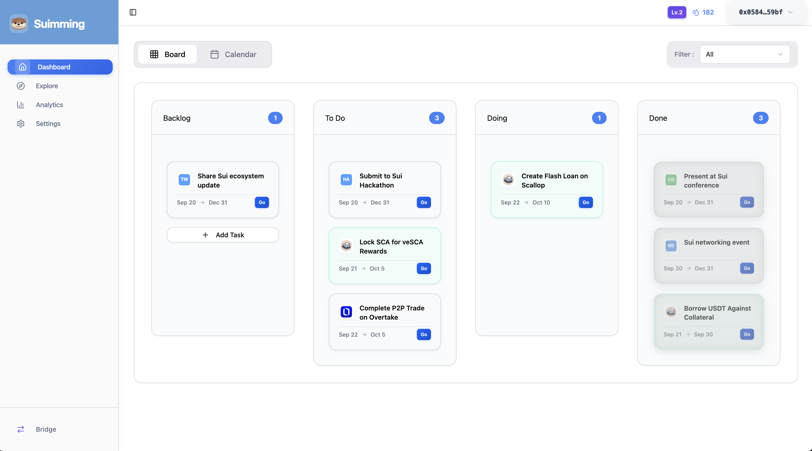
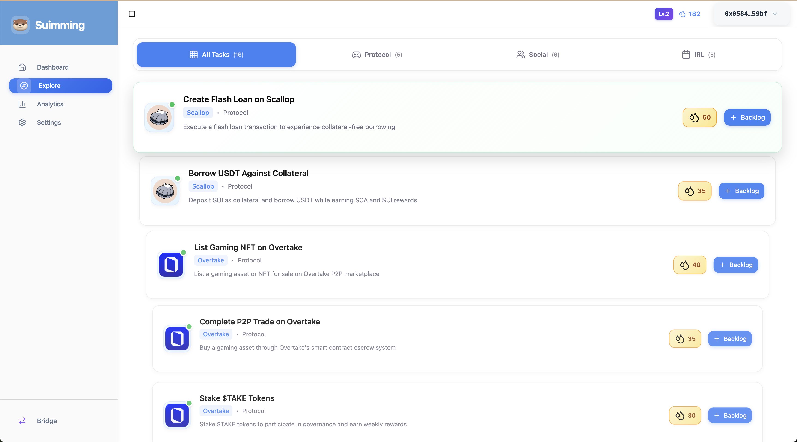
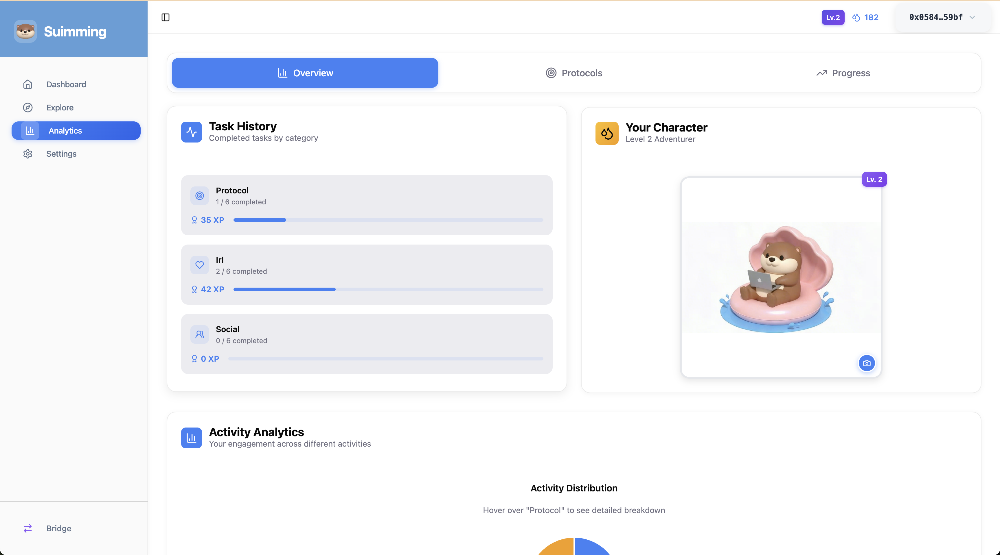

# Suimming 🏊‍♂️

A gamified, task management application that guides users through Web3 ecosystems while helping builders cultivate genuine engagement.

**🌐 Demo:** [farmsy.vercel.app](https://farmsy.vercel.app)

## Overview


*Dashboard - Track your progress and manage tasks*


*Explore - Discover new tasks across different protocols*


*Analytics - Monitor your engagement and growth*

## Problem

New users are often lost when joining a new chain, unsure of what to do first.

Builders struggle to attract and retain genuine, loyal users instead of short-term participants.

## Solution

We provide a structured way to guide users and empower builders:

**For users:** Clear visibility into available tasks, making onboarding simple and engaging.

**For builders:** Tools to cultivate loyalty and measure real engagement, leading to organic ecosystem growth.

### Key Features

- **📋 Task Management** - Archiving and categorizing available tasks across the Sui ecosystem
- **🎯 Gamification** - XP rewards system (Easy: 20 XP, Medium: 35 XP, Hard: 50 XP)
- **📊 Analytics** - On-chain and social activity analysis combined with a points program
- **🤖 AI Insights** - AI-powered activity insights for users and builders
- **🔗 Multi-blockchain Support** - Extensible architecture for multiple blockchain ecosystems
- **💰 Wallet/Bridge Integration** - Seamless Sui wallet connection via zkLogin and cross-chain bridging via Wormhole

## Impact

**For users:** A more guided and rewarding onboarding experience.

**For builders:** A reliable way to foster community, retain genuine users, and drive sustainable ecosystem growth.

**For the ecosystem:** Stronger network effects through transparent engagement measurement and AI-driven insights.

## Tech Stack

- **Frontend:** React 18, TypeScript, Vite
- **UI Components:** Radix UI, Tailwind CSS, Lucide React
- **Walllet Integration:** Sui Wallet Adapter, zkLogin
- **Bridge:** Wormhole

## Getting Started

### Prerequisites
- Node.js 18+
- npm

### Installation

1. **Clone the repository**
   ```bash
   git clone <repository-url>
   cd farmsy
   ```

2. **Install dependencies**
   ```bash
   npm install
   ```

3. **Start development server**
   ```bash
   npm run dev
   ```
   The app will open at `http://localhost:3000`

4. **Build for production**
   ```bash
   npm run build
   ```

### Environment Setup

Create a `.env` file in the root directory with your configuration:
```env
# Add your environment variables here
# zkLogin Configuration
# Get your Google OAuth Client ID from: https://console.cloud.google.com/
VITE_GOOGLE_CLIENT_ID=your_google_client_id_here

# Redirect URL for OAuth callback (usually your domain + /auth/callback)
VITE_REDIRECT_URL=http://localhost:3000/auth/callback

# Optional: Sui Network (defaults to devnet)
VITE_SUI_NETWORK=devnet
```

## Adding New Blockchains

To extend support to additional blockchains:

1. **Update types** in `types/blockchain.ts`
2. **Add protocol data** to `protocol.json`
3. **Add tasks** to `task.json`
4. **Add blockchain icons** to `/public/`